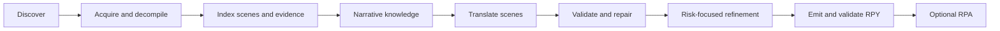

# RenWeave

[](LICENSE)
[](https://www.python.org/)
[](https://github.com/Mehael-Yeh/RenWeave/releases/latest)
[](https://github.com/Mehael-Yeh/RenWeave/releases)

**English** · [简体中文](docs/README.zh-CN.md)

RenWeave is a context-aware Ren'Py localization tool. It understands scripts as scenes and story flow, preserves existing translation work, validates generated RPY files, and can optionally package the result as an RPA archive.

## What it does

- Accepts a game root, a `game` directory, or a game executable.
- Reads loose `.rpy`/`.rpym` files, compiled `.rpyc`/`.rpymc` files, and RPA 2.0/3.0/3.2 archives.
- Unpacks and decompiles into an isolated workspace with the bundled, integrity-checked `unrpyc` runtime. Processing does not download executable tools.
- Builds deterministic project, scene, character, relationship, and terminology evidence before any model call.
- Translates at scene level so callbacks, voice, recurring jokes, and local terminology remain available in context.
- Repairs only structurally invalid model output and can run a separate risk-focused refinement pass.
- Detects the target language before translation and reuses valid existing units. Missing, empty, damaged, or source-changed units become incremental work.
- Produces a complete final language folder: the supplied translation files plus the validated incremental additions or changes.
- Runs static Ren'Py validation for generated scripts. An optional Ren'Py SDK or compatible game runtime enables isolated engine validation.
- Keeps completed RPY and RPA artifacts. The original game stays read-only unless installation is explicitly requested.

## Quick start

### Windows executable

Download `RenWeave-<version>-windows-x64.exe` from the [latest GitHub Release](https://github.com/Mehael-Yeh/RenWeave/releases/latest) and launch it. Python is not required for the standalone executable. A model API key is required only when the model translation route is selected.

### Run from source

Python 3.10 or newer is required:

```powershell
git clone https://github.com/Mehael-Yeh/RenWeave.git
cd RenWeave
py -3.10 -m pip install .
renweave-gui
```

The desktop workflow has five steps:

1. **Game** — choose the Ren'Py game and a separate RenWeave workspace.
2. **Languages** — select the source and target languages, including a detected existing target language for incremental work.
3. **Model** — the **Use model for translation** checkbox is enabled by default. The model fields, endpoint, and reasoning controls are displayed directly. Clear the checkbox to use the blank-file route.
4. **Review** — inspect the indexed scope and token estimate. Blank extraction shows `0` Tokens, produces validated RPY files only, and stays on this step.
5. **Translation** — only the model route reaches this step. Clicking the explicit start action begins model work; progress, checkpoints, diagnostics, and output are shown here.

Entering Review never starts a model request. The blank route does not call a model, does not create an RPA, and does not enter step 05. It leaves the extracted and validated RPY translation files for the user to complete manually.

The interface can switch between English and Simplified Chinese. Provider, endpoint, model, and reasoning choices are restored from user settings. API keys use the operating system credential store by default, or can be kept in memory only. Secrets are not written to RenWeave settings, workspaces, logs, or packages.

## Model settings

The desktop app includes editable presets for:

- OpenAI
- Google Gemini
- Anthropic
- DeepSeek
- MiniMax
- Alibaba Cloud Model Studio
- Zhipu AI
- Moonshot AI
- SiliconFlow
- OpenRouter
- two custom OpenAI-compatible endpoints

Enter the exact model ID supported by the selected provider. The base URL and reasoning controls are always visible on step 03; there is no separate Advanced Settings page. RenWeave does not require a model-list request or a manual verification button before continuing. The local profile is checked before Review, and the first real provider request occurs only when model translation is explicitly started on step 05.

For command-line use, copy [`examples/provider.openai-compatible.json`](examples/provider.openai-compatible.json) and keep the secret outside the file:

```json
{
  "kind": "openai_compatible",
  "provider_id": "custom",
  "name": "My provider",
  "model": "my-translation-model",
  "base_url": "https://api.example.com/v1",
  "api_key_env": "RENWEAVE_API_KEY"
}
```

```powershell
$env:RENWEAVE_API_KEY = "your-api-key"
renweave provider-check examples/provider.openai-compatible.json
```

`provider-check` validates the local JSON profile and reports whether a key is configured; it is an offline check and does not call the provider.

## Command-line interface

```text
renweave gui [--project PATH] [--workspace PATH]
renweave analyze TARGET --workspace PATH
renweave decompile TARGET --workspace PATH
renweave run TARGET --workspace PATH --provider CONFIG --target-language LANGUAGE
renweave build --workspace PATH
renweave provider-check CONFIG
renweave unpack ARCHIVE --output PATH [--scripts-only]
```

Command purposes:

- `gui` starts the desktop workflow.
- `analyze` discovers, unpacks, indexes, and builds deterministic knowledge without calling a model.
- `decompile` prepares missing source scripts from compiled Ren'Py scripts.
- `run` executes the model-backed scene translation pipeline.
- `build` rebuilds from validated workspace checkpoints without another model call.
- `provider-check` validates a model profile offline.
- `unpack` safely extracts an RPA archive; `--scripts-only` limits extraction to script-related files.

Example model-backed run:

```powershell
renweave run "D:\Games\Example" `
  --workspace "D:\RenWeaveWork\Example" `
  --provider examples/provider.openai-compatible.json `
  --source-language auto `
  --target-language "简体中文"
```

Useful `run` and `build` options include:

- `--no-rpa` keeps the validated RPY folder without creating an archive.
- `--install` copies the validated result into the game's `game/tl/<language>` directory.
- `--overwrite-existing` allows installation to replace same-name files that were not created by RenWeave.
- `--renpy-sdk` supplies an SDK for isolated engine compilation; `--require-renpy-validation` makes that validation mandatory.
- `--no-ai-knowledge` skips model-based narrative synthesis and uses deterministic evidence only.
- `--no-refine` skips the risk-focused refinement pass.
- `--limit` and `--repair-attempts` are useful for controlled runs and testing.

Blank translation extraction is currently a desktop workflow: clear **Use model for translation** on step 03 and choose **Extract blank translation**.

## Incremental translation and output rules

Before translation, RenWeave scans `game/tl/<language>` and the reusable checkpoints in the workspace. A valid existing translation is preserved. Only missing, empty, structurally invalid, or source-changed units are regenerated.

The final language directory follows these rules:

1. Start with a complete copy of the original translation files, when they exist.
2. Merge new or changed dialogue blocks into their corresponding RPY files at the correct source-order position. The resulting order matches a clean build with the same additions.
3. Keep string translations in one terminal `translate <language> strings:` block. Existing rows are consolidated there; new `old`/`new` pairs are appended without writing another header.
4. Create a new ordinary RPY file only when its corresponding source file does not already exist.
5. Build the optional RPA from every RPY in that exact final language directory.

This makes the RPY folder and the RPA archive equivalent in script coverage and behavior. `--install` is the only normal route that writes into the original game, and the installer refuses to overwrite non-RenWeave files unless `--overwrite-existing` is supplied.

## Workspace, checkpoints, and artifacts

Use a dedicated work directory such as `D:\RenWeaveWork\Example`. The workspace stores the project understanding and translation progress so the original game directory remains untouched:

```text
RenWeaveWork/Example/
├─ state.json
├─ project-index.json
├─ knowledge.json
├─ narrative-knowledge.json       (when narrative synthesis is used)
├─ acquisition.json
├─ decompilation.json
├─ acquired/  decompiled/  tools/
├─ translations/  reports/  validation/
├─ existing-translations.json
├─ translation-memory.json
├─ usage.json
├─ logs/renweave.log
├─ logs/events.jsonl
├─ output/
│  └─ build-<content-fingerprint>/game/tl/<language>/*.rpy
├─ packages/
│  └─ renweave-<language>-<content-fingerprint>.rpa
├─ package.json
└─ build-validation.json
```

Not every optional file or directory is present in every run. State, knowledge, checkpoints, reports, and usage are saved atomically. `usage.json` records estimates, successful and attempted requests, provider-reported input/output Tokens, and phase totals; it is a usage ledger, not a billing statement.

Completed RPY and RPA artifacts are content-addressed and retained. RenWeave does not delete or replace an already generated RPY or RPA. Automatic cleanup is limited to guarded intermediate files and directories whose own names begin with `_`. Reusing the same project and workspace resumes from valid checkpoints; a workspace lock prevents concurrent writers, and repeated scene failures stop through a circuit breaker instead of endlessly retrying.

## Validation and compatibility

- Static validation checks generated Ren'Py syntax, tags, interpolation, placeholders, IDs, and translation structure.
- If a compatible Ren'Py runtime or `--renpy-sdk` is available, engine compilation runs in an isolated staging project. `--require-renpy-validation` turns missing or failed engine validation into an error.
- RPA output is written only after the final RPY language directory passes validation. When validated compiled sidecars are available, the archive can include them and records `runtime_ready` in `package.json`.
- The bundled decompiler is pinned and integrity checked. No game asset or Ren'Py runtime is redistributed by the repository.
- Only process games you are authorized to inspect or modify. Do not put API keys, copyrighted game files, or private model responses in issues or pull requests.

## How the model-backed pipeline works



Deterministic indexing, scene-specific context, content-addressed caches, targeted repairs, and risk-focused refinement keep model work focused. The blank route stops after extraction and static validation, so its token count is exactly zero.

## Development

```powershell
py -3.10 -m pip install --editable . --no-deps
$env:PYTHONPATH = "src"
py -3.10 -m pytest -q
py -3.10 scripts/qt_visual_smoke_test.py
py -3.10 -m compileall -q src tests packaging
py -3.10 -m pip install build
py -3.10 -m build
```

The Windows standalone executable is built by `scripts/build_windows_exe.py` on Windows after installing the package with the release version supplied through `SETUPTOOLS_SCM_PRETEND_VERSION` and `RENWEAVE_BUILD_VERSION`. The GitHub Actions release workflow accepts a canonical PEP 440 version, builds the wheel, source archive, and Windows executable, verifies them, generates `SHA256SUMS`, and publishes the GitHub Release.

## Project information

- [Chinese documentation](docs/README.zh-CN.md)
- [Project status and boundaries](PROJECT_STATUS.md)
- [Changelog](CHANGELOG.md)
- [Contributing](CONTRIBUTING.md)
- [Security policy](SECURITY.md)
- [GPL-3.0 license](LICENSE)
- [Third-party notices](THIRD_PARTY_NOTICES.md)

Issues and pull requests are welcome. Please keep credentials, private responses, and copyrighted game assets out of public reports.
