# RenWeave

[](LICENSE)
[](https://www.python.org/)
[](https://github.com/Mehael-Yeh/RenWeave/releases/latest)
[](https://github.com/Mehael-Yeh/RenWeave/releases)

**English** · [简体中文](docs/README.zh-CN.md)

Context-aware, one-click translation for Ren'Py games. RenWeave understands scenes, story flow, characters, relationships, and terminology before it translates—then validates, refines, and packages the result for any target language supported by your model.

## Why RenWeave

Line-by-line translation loses callbacks, character voice, running jokes, and terms whose meaning changes with the scene. RenWeave treats the scene as the translation unit and uses the individual line only as the safe write-back address.

- No manual world bible, character list, or glossary forms.
- Any source and target language; Simplified Chinese is not a hard-coded default.
- Safe RPA unpacking and isolated RPYC/RPYMC decompilation.
- Evidence-backed story and character understanding with compact, relevant prompts.
- A preflight Token budget before starting and a persistent provider-reported usage ledger while running.
- Structural validation for Ren'Py tags, interpolation, placeholders, IDs, and generated scripts.
- Existing `game/tl/<language>` folders are detected before translation. Valid user translations are preserved, while only missing, empty, structurally damaged, or source-changed units are sent for incremental translation.
- Selective cross-scene refinement instead of paying to resend every translated line.
- Validated standard RPY language directories in every run, plus optional RPA 3.0 archives enabled by default. When a game-bundled Ren'Py runtime or SDK is available, the archive includes verified RPYC sidecars and is marked `runtime_ready`.
- Original game files remain read-only unless installation is explicitly enabled.

## Quick start

Windows users can download the versioned `RenWeave-<version>-windows-x64.exe` from the latest GitHub Release and launch it directly; Python is not required. You still need an API key for a supported provider.

To run from source instead, use Python 3.10 or newer:

```powershell
git clone https://github.com/Mehael-Yeh/RenWeave.git
cd RenWeave
python -m pip install .
renweave-gui
```

The desktop app guides you through five steps:

1. Choose a provider, enter its API key, load its model list, and verify the selected model.
2. Choose the Ren'Py game and an isolated workspace. A bundled compatible Ren'Py runtime is filled in automatically; the interface explains the built-in static fallback when none exists.
3. Choose an existing language for incremental translation, or choose any new source and target languages.
4. Review the automatically selected pipeline, output options, and estimated Token budget.
5. Start once and follow unpacking, analysis, translation, refinement, validation, optional RPA packaging, ETA, and Token usage.

English is the default interface language. Use the single **中文** / **English** button beside **Settings** to switch directly to the other interface language. Provider, endpoint, model, and thinking-level choices are restored per user. API keys default to the operating system's encrypted credential store; **Settings** can switch them to memory-only storage. Keys never enter RenWeave settings or project files. Optional version checks are off by default.

## Providers and model validation

The app includes editable presets for common official APIs and aggregators. It validates the endpoint, fetches the account's current `/models` catalog without merging stale built-in model names, keeps exact model IDs editable, maps one thinking-level control to provider-supported request parameters, tests the selected model with one minimal request, and saves a reusable profile without its secret. If an endpoint does not expose `/models`, enter the exact model ID and verify it directly.

Desktop settings are stored at `%APPDATA%\RenWeave\settings.json` on Windows or `${XDG_CONFIG_HOME:-~/.config}/RenWeave/settings.json` on Linux. The file contains no API key. Secure keys use the dedicated `RenWeave API Credentials` namespace in the OS credential service through `keyring` (Windows Credential Manager on Windows); memory-only mode never persists them.

| Provider | Preset endpoint | Notes |
| --- | --- | --- |
| [OpenAI](https://platform.openai.com/docs/api-reference/models) | `https://api.openai.com/v1` | Official model discovery and Chat Completions |
| [Google Gemini](https://ai.google.dev/gemini-api/docs/openai) | `https://generativelanguage.googleapis.com/v1beta/openai` | Official OpenAI-compatible endpoint |
| [Anthropic](https://platform.claude.com/docs/en/cli-sdks-libraries/libraries/openai-sdk) | `https://api.anthropic.com/v1` | Claude compatibility layer; JSON response parameters are omitted |
| [DeepSeek](https://api-docs.deepseek.com/) | `https://api.deepseek.com` | Official OpenAI-compatible API; `/v1` is also selectable |
| [MiniMax](https://platform.minimax.io/docs/api-reference/models/openai/list-models) | `https://api.minimax.io/v1` | International and mainland China endpoints |
| [Alibaba Cloud Model Studio](https://help.aliyun.com/en/model-studio/deep-thinking) | `https://dashscope.aliyuncs.com/compatible-mode/v1` | Mainland China and international DashScope endpoints |
| [Zhipu AI](https://docs.bigmodel.cn/cn/guide/capabilities/thinking) | `https://open.bigmodel.cn/api/paas/v4` | Official BigModel API |
| [Moonshot AI](https://platform.moonshot.cn/) | `https://api.moonshot.cn/v1` | Official Kimi API |
| [SiliconFlow](https://docs.siliconflow.cn/cn/api-reference/models/get-model-list) | `https://api.siliconflow.cn/v1` | Aggregated live account catalog |
| [OpenRouter](https://openrouter.ai/docs/api/api-reference/models/get-models) | `https://openrouter.ai/api/v1` | Aggregated model catalog |
| Custom | Editable | Any third-party or local OpenAI-compatible endpoint |

For CLI use, copy [`examples/provider.openai-compatible.json`](examples/provider.openai-compatible.json):

```json
{
  "kind": "openai_compatible",
  "provider_id": "custom",
  "name": "My provider",
  "model": "my-translation-model",
  "base_url": "https://api.example.com/v1",
  "api_key_env": "RENWEAVE_API_KEY"
}
```

Keep secrets outside JSON:

```powershell
$env:RENWEAVE_API_KEY = "your-api-key"
renweave provider-check examples/provider.openai-compatible.json
renweave run "D:\Games\Example" `
  --workspace "D:\RenWeaveWork\Example" `
  --provider examples/provider.openai-compatible.json `
  --source-language auto `
  --target-language "Português do Brasil"
```

Add `--install` only when you want the verified RPY output copied to `game/tl/<language>`. RPA creation is enabled by default; RenWeave automatically uses a compatible runtime bundled with the game, or `--renpy-sdk`, to compile and validate RPYC sidecars without modifying the original game. `package.json` records whether the archive is immediately loadable as `runtime_ready`. Add `--no-rpa` to keep only the validated RPY files. Use `renweave build --workspace <path>` to rebuild outputs from validated checkpoints without another model call.

## Progress, pause, and recovery

The review screen estimates an input/output/total Token range before any translation call. Loose source scripts produce the strongest preflight estimate; compiled scripts and archives use a deliberately wider proxy until indexing reveals the exact translatable text. The range includes narrative synthesis, scene context, target output, likely repairs, and risk-only refinement. It excludes provider retries and currency pricing because prices differ by model and provider.

During translation, the progress screen separates progress from diagnostics: a continuously moving activity bar confirms the worker is alive, an exact `n/15` pipeline-stage indicator and completed/current/pending phase track show where the job is, and the weighted 0–100% bar shows overall completion. A separate file counter names the file currently being understood, translated, or refined and shows completed and remaining files. Scene checkpoints, model calls, provider-reported input/output Tokens, the current project estimate, and adaptive remaining time remain visible above the separate log area. It also states when a provider does not return usage metadata so a zero never implies free usage. ETA appears after the first scene checkpoint and is recalculated from observed scene durations; it remains approximate because provider latency and scene size vary.

`usage.json` is updated atomically in the workspace after every state save. It records the estimate, successful calls, attempted requests, reported input/output totals, and separate knowledge, scene translation/repair, and refinement usage. This is a Token ledger, not a billing statement; the provider dashboard remains authoritative for money charged.

**Pause safely** finishes the current network request or local atomic unit, saves the latest valid checkpoint, and stops before the next unit. Starting again with the same project, workspace, and languages resumes automatically. CLI users can press `Ctrl+C` and rerun the same command.

Before reusing work, RenWeave verifies:

- the content fingerprint of source scripts, compiled scripts, and archives;
- the saved project and language settings;
- every completed scene artifact against the current structural validator.
- every matching existing-language unit against the current English/source statement, Ren'Py tags, interpolation variables, and placeholders.

Missing, damaged, or stale scene artifacts are translated again; valid scenes are not resent. A workspace lock prevents concurrent writers, and three consecutive scene failures open a circuit breaker instead of repeatedly calling an unavailable API.

Diagnostics are always retained under the workspace:

- `state.json` — resumable task state, progress, ETA, usage, and current operation;
- `usage.json` — preflight/indexed estimate and provider-reported Token ledger by phase;
- `translations/` and `reports/` — atomic scene checkpoints and validation reports;
- `existing-translations.json` — detected language, reusable/missing/invalid unit counts, and non-secret issue summaries;
- `logs/renweave.log` — readable chronological log;
- `logs/events.jsonl` — structured events with exception type and traceback.

Durable project knowledge and work-in-progress also remain in that workspace: `knowledge.json` and optional `narrative-knowledge.json` hold world and story understanding, while `translations/`, `reports/`, `state.json`, and `usage.json` hold validated scene work and progress. Completed artifacts are append-only: each RPY result is written under `output/build-<content-fingerprint>/`, and each RPA under `packages/` has a content fingerprint in its filename. RenWeave never cleans or replaces an earlier RPY/RPA artifact. Automatic deletion is restricted to guarded intermediate files or directories whose own names start with `_`.

For an incremental language build, the final `game/tl/<language>/` directory is a complete copy of the supplied translation folder plus the validated delta. Missing or changed dialogue blocks are merged into the corresponding copied RPY file in source order, producing the same ordering as a clean build. Each touched script has at most one terminal `translate <language> strings:` block; existing string rows are consolidated there and new `old`/`new` pairs are appended without another header. A new ordinary RPY file is created only when no corresponding file exists. The RPA is then built from every RPY in that exact final language directory, so the folder and archive expose the same source scripts and translation behavior.

## Interface design

RenWeave uses an **Aurora Workbench** design: Windows 11–informed rounded controls, an obsidian workflow rail, a cloud-gray work canvas, and restrained indigo/cyan accents. Microsoft YaHei UI and system-native typography keep English and Chinese aligned, while one stable responsive shell prevents resize-driven page rebuilds. The same 8-point spacing rhythm, field treatment, semantic status panels, dialog structure, and three-level button hierarchy are used throughout:

- **Primary** for the single next or confirming action.
- **Secondary** for back, cancellation, pause, and other non-destructive alternatives.
- **Field action** for browse, choose, copy, and controls attached to a specific field.

The design is influenced by modern developer tools and editorial workspaces rather than a decorative game launcher. Component rendering uses the bundled [Sun Valley ttk theme](https://github.com/rdbende/Sun-Valley-ttk-theme); semantic states and accessibility follow Material 3 principles. Provider-selection research included [CC Switch](https://github.com/farion1231/cc-switch); RenWeave keeps its own task-specific visual system and workflow. Model setup remains the first step: every official, aggregator, and custom endpoint is always visible in one stable grid, and every endpoint stays editable. Built-in presets replace profile importing, and non-secret API settings save automatically. All five screens and dialogs share the same interaction vocabulary. Inline consequence text and delayed guidance tooltips explain what each important field expects, whether a button contacts an API, whether it may consume Tokens, and what the next step changes.

Keyboard focus uses a solid color border and state contrast—never a dotted focus rectangle. The normative component, alignment, state, and visual-QA rules are documented in the [desktop design system](docs/UI_DESIGN_SYSTEM.md).

## How it works

```mermaid
flowchart LR
    A[Discover] --> B[Unpack and decompile]
    B --> C[Scene graph and evidence]
    C --> D[Narrative synthesis]
    D --> E[Context-aware translation]
    E --> F[Validate and repair]
    F --> G[Risk-only refinement]
    G --> H[Build and verify RPY files]
    H --> I[Optional RPA archive]
```



RenWeave limits extra Token use through deterministic pre-analysis, hierarchical evidence summaries, scene-specific context, content-addressed caches, targeted repairs, and risk-only global refinement. Estimated and reported usage, request counts, phase breakdowns, and cache-aware resumability are recorded in the workspace.

## Compatibility and safety

- Reads `.rpy`, `.rpym`, `.rpyc`, `.rpymc`, and RPA 2.0/3.0/3.2 archives.
- Ships the pinned, integrity-verified unrpyc 2.0.4 runtime and license inside the package; no executable tool is downloaded while processing a game.
- Always performs static generated-script validation. An optional Ren'Py SDK enables isolated engine compilation; `--require-renpy-validation` makes it mandatory.
- Only process games you are authorized to modify. Do not report secrets or proprietary game assets in public issues.

See [Security](SECURITY.md) for trust boundaries and vulnerability reporting.

## Development

```powershell
$env:PYTHONPATH = "src"
python -m unittest discover -s tests -v
python -m compileall -q src tests
python -m pip install build
python -m build
```

CI tests Python 3.10 and 3.13 on Windows and Linux. Maintainers publish from **Actions → Release → Run workflow**. The canonical PEP 440 version entered there is the single release-version source: Actions injects it into the wheel, source archive, standalone Windows GUI executable, filenames, and release tag. The workflow verifies the embedded versions and bundled decompiler before publishing; no source file needs a version edit.

## Project information

- [Chinese documentation](docs/README.zh-CN.md)
- [Project status and boundaries](PROJECT_STATUS.md)
- [Changelog](CHANGELOG.md)
- [Contributing](CONTRIBUTING.md)
- [Security policy](SECURITY.md)
- [GPL-3.0 license](LICENSE)
- [Third-party notices](THIRD_PARTY_NOTICES.md)

Issues and pull requests are welcome. Please never include API keys, copyrighted game files, or private model responses.
