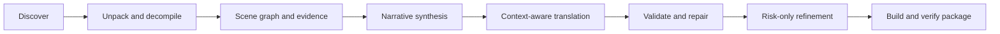

# RenWeave

[](https://github.com/Mehael-Yeh/RenWeave/actions/workflows/ci.yml)
[](https://www.python.org/)
[](LICENSE)

**English** · [简体中文](docs/README.zh-CN.md)

Context-aware, one-click translation for Ren'Py games. RenWeave understands scenes, story flow, characters, relationships, and terminology before it translates—then validates, refines, and packages the result for any target language supported by your model.

## Why RenWeave

Line-by-line translation loses callbacks, character voice, running jokes, and terms whose meaning changes with the scene. RenWeave treats the scene as the translation unit and uses the individual line only as the safe write-back address.

- No manual world bible, character list, or glossary forms.
- Any source and target language; Simplified Chinese is not a hard-coded default.
- Safe RPA unpacking and isolated RPYC/RPYMC decompilation.
- Evidence-backed story and character understanding with compact, relevant prompts.
- A preflight Token budget before starting and a persistent provider-reported usage ledger while running.
- Structural validation for Ren'Py tags, interpolation, placeholders, IDs, and generated scripts.
- Selective cross-scene refinement instead of paying to resend every translated line.
- Deterministic language directories and verified RPA 3.0 packages.
- Original game files remain read-only unless installation is explicitly enabled.

## Quick start

Requirements: Python 3.10 or newer and an API key for a supported provider.

```powershell
git clone https://github.com/Mehael-Yeh/RenWeave.git
cd RenWeave
python -m pip install .
renweave-gui
```

The desktop app guides you through five steps:

1. Choose a provider, enter its API key, load its model list, and verify the selected model.
2. Choose the Ren'Py game and an isolated workspace.
3. Choose any source and target languages.
4. Review the automatically selected pipeline, output options, and estimated Token budget.
5. Start once and follow unpacking, analysis, translation, refinement, validation, packaging, ETA, and Token usage.

English is the default interface language. Choose **简体中文** from the top-right language menu to switch immediately. API keys entered in the app remain in memory; the generated provider profile never contains the key.

## Providers and model validation

The app includes editable presets for common official APIs and aggregators. It validates the endpoint, discovers models, keeps exact model IDs editable, tests the selected model with one minimal request, and saves a reusable profile without its secret. If an endpoint does not expose `/models`, enter the exact model ID and verify it directly.

| Provider | Preset endpoint | Notes |
| --- | --- | --- |
| [OpenAI](https://platform.openai.com/docs/api-reference/models) | `https://api.openai.com/v1` | Official model discovery and Chat Completions |
| [Google Gemini](https://ai.google.dev/gemini-api/docs/openai) | `https://generativelanguage.googleapis.com/v1beta/openai` | Official OpenAI-compatible endpoint |
| [Anthropic](https://platform.claude.com/docs/en/cli-sdks-libraries/libraries/openai-sdk) | `https://api.anthropic.com/v1` | Claude compatibility layer; JSON response parameters are omitted |
| [DeepSeek](https://api-docs.deepseek.com/) | `https://api.deepseek.com` | Official OpenAI-compatible API; `/v1` is also selectable |
| [MiniMax](https://platform.minimax.io/docs/api-reference/models/openai/list-models) | `https://api.minimax.io/v1` | International and mainland China endpoints |
| [OpenRouter](https://openrouter.ai/docs/api/api-reference/models/get-models) | `https://openrouter.ai/api/v1` | Aggregated model catalog |
| Custom | Editable | Any third-party or local OpenAI-compatible endpoint |

For CLI use, copy [`examples/provider.openai-compatible.json`](examples/provider.openai-compatible.json):

```json
{
  "kind": "openai_compatible",
  "provider_id": "custom",
  "name": "My provider",
  "model": "my-translation-model",
  "base_url": "https://api.example.com/v1",
  "api_key_env": "RENWEAVE_API_KEY"
}
```

Keep secrets outside JSON:

```powershell
$env:RENWEAVE_API_KEY = "your-api-key"
renweave provider-check examples/provider.openai-compatible.json
renweave run "D:\Games\Example" `
  --workspace "D:\RenWeaveWork\Example" `
  --provider examples/provider.openai-compatible.json `
  --source-language auto `
  --target-language "Português do Brasil"
```

Add `--install` only when you want the verified output copied to `game/tl/<language>`. Use `renweave build --workspace <path>` to rebuild a package from validated checkpoints without another model call.

## Progress, pause, and recovery

The review screen estimates an input/output/total Token range before any translation call. Loose source scripts produce the strongest preflight estimate; compiled scripts and archives use a deliberately wider proxy until indexing reveals the exact translatable text. The range includes narrative synthesis, scene context, target output, likely repairs, and risk-only refinement. It excludes provider retries and currency pricing because prices differ by model and provider.

During translation, the progress screen shows a weighted 0–100% pipeline bar, the active phase and scene, verified scene checkpoints, model calls, provider-reported input/output Tokens, the current project estimate, and an adaptive remaining-time estimate. It also states when a provider does not return usage metadata so a zero never implies free usage. ETA appears after the first scene checkpoint and is recalculated from observed scene durations; it remains approximate because provider latency and scene size vary.

`usage.json` is updated atomically in the workspace after every state save. It records the estimate, successful calls, attempted requests, reported input/output totals, and separate knowledge, scene translation/repair, and refinement usage. This is a Token ledger, not a billing statement; the provider dashboard remains authoritative for money charged.

**Pause safely** finishes the current network request or local atomic unit, saves the latest valid checkpoint, and stops before the next unit. Starting again with the same project, workspace, and languages resumes automatically. CLI users can press `Ctrl+C` and rerun the same command.

Before reusing work, RenWeave verifies:

- the content fingerprint of source scripts, compiled scripts, and archives;
- the saved project and language settings;
- every completed scene artifact against the current structural validator.

Missing, damaged, or stale scene artifacts are translated again; valid scenes are not resent. A workspace lock prevents concurrent writers, and three consecutive scene failures open a circuit breaker instead of repeatedly calling an unavailable API.

Diagnostics are always retained under the workspace:

- `state.json` — resumable task state, progress, ETA, usage, and current operation;
- `usage.json` — preflight/indexed estimate and provider-reported Token ledger by phase;
- `translations/` and `reports/` — atomic scene checkpoints and validation reports;
- `logs/renweave.log` — readable chronological log;
- `logs/events.jsonl` — structured events with exception type and traceback.

## Interface design

RenWeave uses a **Calm Technical Workspace** design: a persistent dark workflow rail, a high-contrast light work canvas, compact provider tiles, and one restrained indigo accent. The same 8-point spacing rhythm, field treatment, status panels, dialog structure, and three-level button hierarchy are used throughout:

- **Primary** for the single next or confirming action.
- **Secondary** for an important action that does not advance the workflow.
- **Ghost** for navigation, browsing, importing, and cancellation.

The design is influenced by modern developer tools and editorial workspaces rather than a decorative game launcher. Provider-selection research included [CC Switch](https://github.com/farion1231/cc-switch); RenWeave keeps its own task-specific visual system and implementation. The model-first setup stays visible, every endpoint remains editable, and all five screens and dialogs share the same interaction vocabulary. Inline consequence text and delayed guidance tooltips explain what each important field expects, whether a button contacts an API, whether it may consume Tokens, and what the next step changes.

The normative component, alignment, state, and visual-QA rules are documented in the [desktop design system](docs/UI_DESIGN_SYSTEM.md).

## How it works



RenWeave limits extra Token use through deterministic pre-analysis, hierarchical evidence summaries, scene-specific context, content-addressed caches, targeted repairs, and risk-only global refinement. Estimated and reported usage, request counts, phase breakdowns, and cache-aware resumability are recorded in the workspace.

## Compatibility and safety

- Reads `.rpy`, `.rpym`, `.rpyc`, `.rpymc`, and RPA 2.0/3.0/3.2 archives.
- Downloads a pinned, SHA-256-verified unrpyc release only when compiled scripts require it; `--no-tool-download` forces offline operation.
- Always performs static generated-script validation. An optional Ren'Py SDK enables isolated engine compilation; `--require-renpy-validation` makes it mandatory.
- Only process games you are authorized to modify. Do not report secrets or proprietary game assets in public issues.

See [Security](SECURITY.md) for trust boundaries and vulnerability reporting.

## Development

```powershell
$env:PYTHONPATH = "src"
python -m unittest discover -s tests -v
python -m compileall -q src tests
python -m pip install build
python -m build
```

CI tests Python 3.10 and 3.13 on Windows and Linux. Maintainers can publish a tagged GitHub release from **Actions → Release → Run workflow** after the requested version matches the package version.

## Project information

- [Chinese documentation](docs/README.zh-CN.md)
- [Project status and boundaries](PROJECT_STATUS.md)
- [Changelog](CHANGELOG.md)
- [Contributing](CONTRIBUTING.md)
- [Security policy](SECURITY.md)
- [GPL-3.0 license](LICENSE)

Issues and pull requests are welcome. Please never include API keys, copyrighted game files, or private model responses.
