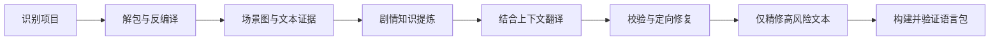

# RenWeave / 织译

[](https://github.com/Mehael-Yeh/RenWeave/actions/workflows/ci.yml)
[](https://www.python.org/)
[](../LICENSE)

[English](../README.md) · **简体中文**

Ren'Py 游戏的上下文感知一键翻译工具。织译会先理解场景、剧情流、角色、关系与术语，再完成翻译、校验、精修和打包；只要模型支持，就可以翻译到任意目标语言。

## 为什么选择织译

逐行翻译会丢失剧情呼应、角色语气、隐藏笑点，以及随场景改变含义的术语。织译以场景为翻译单位，只把单行文本作为安全写回地址。

- 不要求手工填写世界观、角色表或术语表。
- 支持任意源语言和目标语言，不把简体中文硬编码为默认目标。
- 安全解包 RPA，并在隔离工作区反编译 RPYC/RPYMC。
- 先建立带证据的剧情与角色认知，再提供紧凑且相关的模型上下文。
- 校验 Ren'Py 标签、插值、占位符、文本 ID 与生成脚本结构。
- 只精修跨场景高风险文本，避免把全部译文重复发送给模型。
- 生成确定性的语言目录与通过回读验证的 RPA 3.0 包。
- 除非用户明确开启安装，否则游戏原目录保持只读。

## 快速开始

需要 Python 3.10 或更高版本，以及兼容 OpenAI Chat Completions 的 API。

```powershell
git clone https://github.com/Mehael-Yeh/RenWeave.git
cd RenWeave
python -m pip install .
renweave-gui
```

桌面程序按五步引导操作：

1. 填写 API 地址和密钥，获取模型列表并验证所选模型。
2. 选择 Ren'Py 游戏与独立工作区。
3. 选择任意源语言和目标语言。
4. 确认自动化流程与输出选项。
5. 一次启动，持续查看解包、分析、翻译、精修、验证与打包进度。

界面默认显示英文；可在右上角选择 **简体中文** 即时切换。界面中填写的 API 密钥仅保留在内存，自动保存的模型配置不会包含密钥。

## 模型配置

推荐直接使用桌面程序：它会验证接口、获取模型列表、用一次最小请求测试所选模型，并自动保存可复用配置。

CLI 用户可复制 [`examples/provider.openai-compatible.json`](../examples/provider.openai-compatible.json)：

```json
{
  "kind": "openai_compatible",
  "name": "My provider",
  "model": "my-translation-model",
  "base_url": "https://api.example.com/v1",
  "api_key_env": "RENWEAVE_API_KEY"
}
```

请把密钥放在 JSON 之外：

```powershell
$env:RENWEAVE_API_KEY = "your-api-key"
renweave provider-check examples/provider.openai-compatible.json
renweave run "D:\Games\Example" `
  --workspace "D:\RenWeaveWork\Example" `
  --provider examples/provider.openai-compatible.json `
  --source-language auto `
  --target-language "Português do Brasil"
```

只有需要把验证后的输出复制到 `game/tl/<language>` 时才添加 `--install`。使用 `renweave build --workspace <路径>` 可以从已经通过验证的检查点重新打包，不再调用模型。

## 工作方式



织译通过确定性预分析、分层证据摘要、场景相关上下文、内容寻址缓存、定向修复和风险文本精修来控制额外 Token 消耗。模型用量与缓存命中会记录在工作区中。

## 兼容性与安全

- 读取 `.rpy`、`.rpym`、`.rpyc`、`.rpymc` 和 RPA 2.0/3.0/3.2。
- 只有编译脚本确实需要时，才下载固定版本且通过 SHA-256 校验的 unrpyc；`--no-tool-download` 可强制离线。
- 始终执行生成脚本静态验证。可选 Ren'Py SDK 用于隔离引擎编译；`--require-renpy-validation` 会把它设为强制要求。
- 只处理你有权修改的游戏；不要在公开 Issue 中提交密钥或游戏资产。

完整边界与漏洞报告方式见[安全策略](../SECURITY.md)。

## 开发

```powershell
$env:PYTHONPATH = "src"
python -m unittest discover -s tests -v
python -m compileall -q src tests
python -m pip install build
python -m build
```

CI 会在 Windows 与 Linux 上测试 Python 3.10 和 3.13。维护者可在 **Actions → Release → Run workflow** 中填写与项目版本一致的版本号，手动发布带标签的 GitHub Release。

## 项目信息

- [English README](../README.md)
- [项目状态与边界](../PROJECT_STATUS.md)
- [版本记录](../CHANGELOG.md)
- [贡献指南](../CONTRIBUTING.md)
- [安全策略](../SECURITY.md)
- [GPL-3.0 许可证](../LICENSE)

欢迎提交 Issue 和 Pull Request。请勿提交 API 密钥、受版权保护的游戏文件或私有模型响应。
