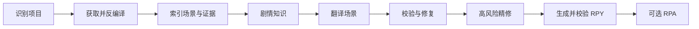

# RenWeave / 织译

[](../LICENSE)
[](https://www.python.org/)
[](https://github.com/Mehael-Yeh/RenWeave/releases/latest)
[](https://github.com/Mehael-Yeh/RenWeave/releases)

[English](../README.md) · **简体中文**

织译是面向 Ren'Py 游戏的上下文感知本地化工具。它把脚本按场景和剧情流理解，保留已有翻译，校验生成的 RPY 文件，并可按需将最终语言包打包为 RPA 归档。

## 功能概览

- 支持选择游戏根目录、`game` 目录或游戏程序。
- 读取散装的 `.rpy`/`.rpym`、编译后的 `.rpyc`/`.rpymc`，以及 RPA 2.0/3.0/3.2 归档。
- 在独立工作区内解包和反编译，内置经过完整性校验的 `unrpyc`；处理游戏时不会下载可执行工具。
- 在调用模型前，先确定性地建立项目、场景、角色、关系和术语证据。
- 以场景为翻译单位，让剧情呼应、角色语气、重复笑点和局部术语保持上下文。
- 只对结构不合格的模型输出做定向修复，并可单独执行高风险文本精修。
- 翻译前扫描目标语言目录并复用有效译文；缺失、空白、结构损坏或英文源文变化的文本才进入增量处理。
- 最终语言目录始终是“原有翻译文件完整副本 + 已校验的新增或修改内容”。
- 始终执行 Ren'Py 生成脚本静态校验；检测到兼容的 Ren'Py SDK 或游戏运行环境时，可在隔离项目中进行引擎校验。
- 已生成的 RPY 和 RPA 成品会保留；除非明确执行安装，原游戏目录保持只读。

## 快速开始

### Windows 独立程序

从[最新 GitHub Release](https://github.com/Mehael-Yeh/RenWeave/releases/latest)下载 `RenWeave-<版本>-windows-x64.exe` 后直接启动，不需要安装 Python。只有选择使用模型翻译时才需要准备模型 API 密钥。

### 从源码运行

需要 Python 3.10 或更高版本：

```powershell
git clone https://github.com/Mehael-Yeh/RenWeave.git
cd RenWeave
py -3.10 -m pip install .
renweave-gui
```

桌面程序分为五步：

1. **游戏**：选择 Ren'Py 游戏和独立的 RenWeave 工作目录。
2. **语言**：选择源语言和目标语言；如果已经存在目标语言目录，也可以直接进行增量翻译。
3. **模型**：默认勾选“使用模型进行翻译”。模型字段、接口地址和思考控制直接展示；取消勾选后进入空白文件路线。
4. **确认**：检查索引范围和 Token 预估。空白路线显示 `0` Token，只生成已经校验的 RPY 文件，并停留在本页。
5. **翻译**：只有使用模型的路线会进入本页。点击明确的开始按钮后才会调用模型，并显示进度、检查点、诊断信息和输出。

进入第 04 页不会自动调用模型。空白路线不使用模型、不生成 RPA，也不会进入第 05 页，只会留下提取并校验好的 RPY 翻译文件供用户自行填写。

界面可以在英文和简体中文之间切换。提供商、接口、模型和思考设置会从用户设置中恢复。API 密钥默认保存到操作系统凭据库，也可以选择只保存在内存中；密钥不会写入织译设置、工作区、日志或打包文件。

## 模型设置

桌面程序内置以下可编辑预设：

- OpenAI
- Google Gemini
- Anthropic
- DeepSeek
- MiniMax
- 阿里云百炼
- 智谱清言
- 月之暗面
- 硅基流动
- OpenRouter
- 两个自定义 OpenAI 兼容接口

使用模型翻译时，请填写所选提供商支持的准确模型 ID。03 页始终显示基础 URL 和思考控制，不再有单独的“高级设置”页面。织译不要求先获取模型列表或点击“验证模型”才能继续：进入确认页前只校验本地配置，真正的提供商请求要等到 05 页明确开始模型翻译时才会发生。

命令行用户可以复制[`examples/provider.openai-compatible.json`](../examples/provider.openai-compatible.json)，并把密钥放在 JSON 文件之外：

```json
{
  "kind": "openai_compatible",
  "provider_id": "custom",
  "name": "My provider",
  "model": "my-translation-model",
  "base_url": "https://api.example.com/v1",
  "api_key_env": "RENWEAVE_API_KEY"
}
```

```powershell
$env:RENWEAVE_API_KEY = "your-api-key"
renweave provider-check examples/provider.openai-compatible.json
```

`provider-check`只校验本地 JSON 配置，并报告是否配置了密钥；它是离线检查，不会调用提供商接口。

## 命令行

```text
renweave gui [--project PATH] [--workspace PATH]
renweave analyze TARGET --workspace PATH
renweave decompile TARGET --workspace PATH
renweave run TARGET --workspace PATH --provider CONFIG --target-language LANGUAGE
renweave build --workspace PATH
renweave provider-check CONFIG
renweave unpack ARCHIVE --output PATH [--scripts-only]
```

各命令用途：

- `gui`：启动桌面流程。
- `analyze`：识别、解包、索引并建立确定性知识，不调用模型。
- `decompile`：从编译的 Ren'Py 脚本准备缺少的源脚本。
- `run`：执行模型驱动的场景级翻译流程。
- `build`：从工作区已校验的检查点重新生成，不再调用模型。
- `provider-check`：离线校验模型配置。
- `unpack`：安全解包 RPA；加上 `--scripts-only` 时只提取脚本相关文件。

模型翻译示例：

```powershell
renweave run "D:\Games\Example" `
  --workspace "D:\RenWeaveWork\Example" `
  --provider examples/provider.openai-compatible.json `
  --source-language auto `
  --target-language "简体中文"
```

`run` 和 `build` 常用选项：

- `--no-rpa`：只保留通过校验的 RPY 文件，不生成归档。
- `--install`：将校验后的结果复制到游戏的 `game/tl/<language>`。
- `--overwrite-existing`：安装时允许覆盖不是由织译生成的同名文件。
- `--renpy-sdk`：指定用于隔离引擎编译的 SDK；`--require-renpy-validation` 会强制要求引擎校验。
- `--no-ai-knowledge`：跳过模型剧情知识提炼，只使用确定性证据。
- `--no-refine`：跳过高风险文本精修。
- `--limit`、`--repair-attempts`：用于受控运行和测试。

提取空白翻译目前通过桌面流程完成：在 03 页取消勾选“使用模型进行翻译”，然后点击“提取空白翻译”。

## 增量翻译与输出规则

开始翻译前，织译会扫描 `game/tl/<语言>` 以及工作区中可复用的检查点。有效的已有译文会保留；只有缺失、空白、结构无效或源文已变化的文本会重新生成。

最终语言目录遵循以下规则：

1. 如果有原始翻译文件，先完整复制到最终目录。
2. 新增或变化的对话块直接合并进对应 RPY 的正确源脚本顺序位置，使排列与“从零生成后再加入增量”的结果一致。
3. 字符串翻译集中在一个位于末尾的 `translate <language> strings:` 区块中。已有条目会归并到这里；新增的 `old`/`new` 对直接追加，不再重复写标题。
4. 只有在对应文件确实不存在时，才创建新的普通 RPY 文件。
5. 可选生成的 RPA 会读取这个最终语言目录中的全部 RPY。

因此，磁盘上的 RPY 文件夹与 RPA 归档在脚本覆盖范围和翻译功能上保持一致。只有添加 `--install` 才会正常写入原游戏；安装器默认拒绝覆盖非织译文件，除非同时指定 `--overwrite-existing`。

## 工作区、检查点与成品

建议为每个游戏使用独立的工作目录，例如 `D:\RenWeaveWork\Example`。世界观理解、剧情认知、翻译进展和诊断信息都保存在工作区，原游戏目录不会被分析和校验流程修改：

```text
RenWeaveWork/Example/
├─ state.json
├─ project-index.json
├─ knowledge.json
├─ narrative-knowledge.json       （使用剧情知识提炼时生成）
├─ acquisition.json
├─ decompilation.json
├─ acquired/  decompiled/  tools/
├─ translations/  reports/  validation/
├─ existing-translations.json
├─ translation-memory.json
├─ usage.json
├─ logs/renweave.log
├─ logs/events.jsonl
├─ output/
│  └─ build-<内容指纹>/game/tl/<语言>/*.rpy
├─ packages/
│  └─ renweave-<语言>-<内容指纹>.rpa
├─ package.json
└─ build-validation.json
```

并非每次运行都会产生所有可选文件。状态、知识、检查点、报告和用量均以原子方式保存。`usage.json` 记录预估、成功和尝试请求、提供商报告的输入/输出 Token 以及各阶段用量；它是用量账本，不是账单。

已经生成的 RPY 和 RPA 成品采用内容指纹并保留。织译不会删除或替换已有 RPY/RPA；自动清理仅限于经过守卫检查、且自身名称以 `_` 开头的中间文件或目录。使用相同项目、工作区和语言重新运行即可从有效检查点继续；工作区锁会阻止并行写入，连续场景失败时会触发熔断，避免无休止地重试。

## 校验与兼容性

- 静态校验会检查生成的 Ren'Py 语法、标签、插值、占位符、ID 和翻译结构。
- 如果找到兼容的 Ren'Py 运行环境或通过 `--renpy-sdk` 指定 SDK，会在隔离暂存项目中进行引擎编译；`--require-renpy-validation` 会把缺少或失败的引擎校验视为错误。
- 只有最终 RPY 语言目录通过校验后才会写入 RPA。存在经过引擎校验的编译侧文件时，归档可以包含 RPYC，并在 `package.json` 中记录 `runtime_ready`。
- 软件包内置固定且经过完整性检查的反编译器；本仓库不重新分发游戏资源或 Ren'Py 运行时。
- 只处理你有权检查或修改的游戏。不要在 Issue 或 Pull Request 中提交 API 密钥、受版权保护的游戏文件或私有模型响应。

## 模型翻译流程



确定性索引、场景相关上下文、内容寻址缓存、定向修复和高风险精修共同控制模型用量。空白路线在提取和静态校验后结束，因此 Token 数量严格为 0。

## 开发

```powershell
py -3.10 -m pip install --editable . --no-deps
$env:PYTHONPATH = "src"
py -3.10 -m pytest -q
py -3.10 scripts/visual_smoke_test.py
py -3.10 -m compileall -q src tests packaging
py -3.10 -m pip install build
py -3.10 -m build
```

Windows 独立程序由 Windows 环境中的 `scripts/build_windows_exe.py` 构建。构建前需要使用发行版本设置 `SETUPTOOLS_SCM_PRETEND_VERSION` 并设置 `RENWEAVE_BUILD_VERSION`，同时确保已安装对应版本的包。GitHub Actions 的 Release 工作流接受规范的 PEP 440 版本号，构建 wheel、源码包和 Windows 独立程序，完成自检，生成 `SHA256SUMS`，然后发布 GitHub Release。

## 项目信息

- [English README](../README.md)
- [项目状态与边界](../PROJECT_STATUS.md)
- [版本记录](../CHANGELOG.md)
- [贡献指南](../CONTRIBUTING.md)
- [安全策略](../SECURITY.md)
- [GPL-3.0 许可证](../LICENSE)
- [第三方声明](../THIRD_PARTY_NOTICES.md)

欢迎提交 Issue 和 Pull Request。请勿在公开报告中包含凭据、私有响应或受版权保护的游戏资源。
