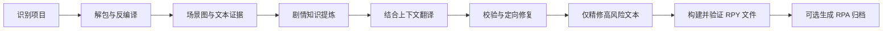

# RenWeave / 织译

[](https://github.com/Mehael-Yeh/RenWeave/actions/workflows/ci.yml)
[](https://www.python.org/)
[](../LICENSE)

[English](../README.md) · **简体中文**

Ren'Py 游戏的上下文感知一键翻译工具。织译会先理解场景、剧情流、角色、关系与术语，再完成翻译、校验、精修和打包；只要模型支持，就可以翻译到任意目标语言。

## 为什么选择织译

逐行翻译会丢失剧情呼应、角色语气、隐藏笑点，以及随场景改变含义的术语。织译以场景为翻译单位，只把单行文本作为安全写回地址。

- 不要求手工填写世界观、角色表或术语表。
- 支持任意源语言和目标语言，不把简体中文硬编码为默认目标。
- 安全解包 RPA，并在隔离工作区反编译 RPYC/RPYMC。
- 先建立带证据的剧情与角色认知，再提供紧凑且相关的模型上下文。
- 开始前提供 Token 预算，运行中持续保存由提供商返回的用量账本。
- 校验 Ren'Py 标签、插值、占位符、文本 ID 与生成脚本结构。
- 在翻译前检查 `game/tl/<语言>` 中已有的语言包：保留有效用户译文，只把缺失、空白、结构损坏或英文源文已变化的单元交给模型增量翻译。
- 只精修跨场景高风险文本，避免把全部译文重复发送给模型。
- 每次都生成并保留通过验证的标准 RPY 语言目录；默认同时生成可关闭的 RPA 3.0 归档。发现游戏内置 Ren'Py 运行时或 SDK 时，归档会包含通过验证的 RPYC，并标记为 `runtime_ready`。
- 除非用户明确开启安装，否则游戏原目录保持只读。

## 快速开始

Windows 用户可以从最新 GitHub Release 下载带版本号的 `RenWeave-<version>-windows-x64.exe` 并直接启动，不需要安装 Python；仍需准备任一受支持提供商的 API 密钥。

如果要从源码运行，请使用 Python 3.10 或更高版本：

```powershell
git clone https://github.com/Mehael-Yeh/RenWeave.git
cd RenWeave
python -m pip install .
renweave-gui
```

桌面程序按五步引导操作：

1. 选择 Ren'Py 游戏与独立工作区。若游戏自带兼容的 Ren'Py 运行环境，程序会自动填写；没有时会明确说明改用内置静态检查，无需用户理解或手填 SDK 术语。
2. 直接选择检测到的已有语言进行增量翻译，或选择任意新的源语言和目标语言。
3. 在 03 页选择翻译方式：默认勾选“使用模型进行翻译”，右下角按钮显示“继续”；取消勾选即可提取空白翻译。
4. 确认准确范围。空白翻译路线显示 `0` Token，只生成已经校验的 RPY 文件，不进入第 05 页，也不会生成 RPA。
5. 使用模型的路线才会启动翻译流程，并持续查看解包、分析、翻译、精修、验证、可选 RPA 打包、ETA 与 Token 用量。

界面默认显示英文；右上角只保留一个 **中文** / **English** 按钮，点击后直接切换到另一种界面语言。提供商、接口、模型与思考等级会从用户设置中自动恢复。API 密钥默认保存到操作系统加密凭据库，也可在“设置”中改为仅内存；密钥永远不会写入织译设置或项目文件。版本自动检查默认关闭。

## 提供商与模型设置

桌面程序内置常见官方 API 与聚合平台的可编辑预设。勾选使用模型翻译后，填写准确的模型 ID；基础 URL 和思考等级会直接展示在 03 页。程序不再要求单独获取模型列表或手动验证模型，真正翻译时会通过实际请求完成校验，并自动保存不含密钥的可复用配置。

Windows 设置文件位于 `%APPDATA%\RenWeave\settings.json`，Linux 位于 `${XDG_CONFIG_HOME:-~/.config}/RenWeave/settings.json`；其中不包含 API 密钥。安全模式通过 `keyring` 使用系统凭据服务中的独立 `RenWeave API Credentials` 命名空间（Windows 上为 Windows Credential Manager）；仅内存模式不会持久化密钥。

| 提供商 | 预设地址 | 说明 |
| --- | --- | --- |
| [OpenAI](https://platform.openai.com/docs/api-reference/models) | `https://api.openai.com/v1` | 官方模型发现与 Chat Completions |
| [Google Gemini](https://ai.google.dev/gemini-api/docs/openai) | `https://generativelanguage.googleapis.com/v1beta/openai` | Google 官方 OpenAI 兼容接口 |
| [Anthropic](https://platform.claude.com/docs/en/cli-sdks-libraries/libraries/openai-sdk) | `https://api.anthropic.com/v1` | Claude 兼容层；不发送 JSON 响应参数 |
| [DeepSeek](https://api-docs.deepseek.com/) | `https://api.deepseek.com` | 官方 OpenAI 兼容接口，也可选择 `/v1` 地址 |
| [MiniMax](https://platform.minimax.io/docs/api-reference/models/openai/list-models) | `https://api.minimax.io/v1` | 同时提供国际站和中国大陆地址 |
| [阿里云百炼](https://help.aliyun.com/zh/model-studio/deep-thinking) | `https://dashscope.aliyuncs.com/compatible-mode/v1` | 中国大陆与国际 DashScope 地址 |
| [智谱清言](https://docs.bigmodel.cn/cn/guide/capabilities/thinking) | `https://open.bigmodel.cn/api/paas/v4` | BigModel 官方接口 |
| [月之暗面](https://platform.moonshot.cn/) | `https://api.moonshot.cn/v1` | Kimi 官方接口 |
| [硅基流动](https://docs.siliconflow.cn/cn/api-reference/models/get-model-list) | `https://api.siliconflow.cn/v1` | 按账号实时获取聚合模型目录 |
| [OpenRouter](https://openrouter.ai/docs/api/api-reference/models/get-models) | `https://openrouter.ai/api/v1` | 聚合模型目录 |
| 自定义接口 | 可编辑 | 任意第三方或本地 OpenAI 兼容接口 |

CLI 用户可复制 [`examples/provider.openai-compatible.json`](../examples/provider.openai-compatible.json)：

```json
{
  "kind": "openai_compatible",
  "provider_id": "custom",
  "name": "My provider",
  "model": "my-translation-model",
  "base_url": "https://api.example.com/v1",
  "api_key_env": "RENWEAVE_API_KEY"
}
```

请把密钥放在 JSON 之外：

```powershell
$env:RENWEAVE_API_KEY = "your-api-key"
renweave provider-check examples/provider.openai-compatible.json
renweave run "D:\Games\Example" `
  --workspace "D:\RenWeaveWork\Example" `
  --provider examples/provider.openai-compatible.json `
  --source-language auto `
  --target-language "Português do Brasil"
```

只有需要把验证后的 RPY 输出复制到 `game/tl/<language>` 时才添加 `--install`。默认会生成 RPA；RenWeave 会自动使用游戏内置的兼容 Ren'Py 运行时，或通过 `--renpy-sdk` 指定 SDK，在不修改原游戏的隔离项目中编译并验证 RPYC。`package.json` 会记录归档是否可直接加载为 `runtime_ready`。添加 `--no-rpa` 后只保留通过验证的 RPY 文件。使用 `renweave build --workspace <路径>` 可以从已经通过验证的检查点重新生成输出，不再调用模型。

## 进度、暂停与恢复

确认页面会在任何翻译调用开始前给出输入、输出和总 Token 范围。存在松散源脚本时预估可信度更高；只有编译脚本或归档时会先使用更宽的代理范围，建立索引、得到准确可翻译文本后再更新。该范围包含剧情知识提炼、场景上下文、目标文本、可能的修复与高风险精修，不包含提供商重试和货币价格，因为不同模型和平台的单价不同。

翻译过程中，进度页面把“进度”和“日志”明确分开：持续活动条表明程序仍在运行，`n/15` 显示完整链路所处阶段，加权进度条显示总完成度；独立的文件进度会写清正在理解、翻译或精修哪个文件、已完成多少个文件、还剩多少个文件。场景检查点、模型调用、提供商报告的输入/输出 Token、项目预估和动态剩余时间仍会持续更新。日志只负责诊断，不再承担告诉用户“做到哪里”的职责。如果提供商没有返回用量元数据，界面会明确警告，避免把“0”误解成免费。完成首个场景检查点后开始计算 ETA，并根据实际场景耗时持续更新；由于不同文件长度和 API 延迟不同，该时间仍属于估算值。

工作区中的 `usage.json` 会随每次状态保存以原子方式更新，记录预估范围、成功调用、尝试请求、提供商报告的输入/输出总量，以及剧情知识、场景翻译/修复和全局精修的分项用量。它是 Token 账本，不是账单；实际货币扣费请以提供商控制台为准。

点击**安全暂停**后，织译会完成当前网络请求或本地原子操作，保存最后一个有效检查点，并在进入下一单元前停止。以后使用相同项目、工作区和语言重新启动即可自动继续。CLI 用户可以按 `Ctrl+C`，随后重新执行同一命令。

复用已有工作前会核验：

- 源脚本、编译脚本和归档的内容指纹；
- 已保存的项目与语言设置；
- 每个已完成场景产物能否通过当前结构校验器。
- 已有语言包中的每个匹配文本是否仍对应当前源文，并保持 Ren'Py 标签、变量和占位符结构。

缺失、损坏或过期场景会重新翻译，仍然有效的场景不会再次发送。工作区锁会阻止两个进程同时写入；若连续三个场景失败，熔断机制会停止继续请求，避免在 API 故障时反复消耗。

诊断信息始终保存在工作区：

- `state.json`：可恢复任务状态、进度、ETA、用量与当前操作；
- `usage.json`：开始前/索引后的预估，以及按阶段拆分的提供商 Token 报告；
- `translations/` 与 `reports/`：原子场景检查点和校验报告；
- `existing-translations.json`：已有语言、可复用/缺失/无效文本数量，以及不含密钥的异常摘要；
- `logs/renweave.log`：便于阅读的时间顺序日志；
- `logs/events.jsonl`：包含异常类型和堆栈的结构化事件。

世界观、剧情理解和当前进展同样永久保存在这个工作区：`knowledge.json` 与可选的 `narrative-knowledge.json` 保存世界和剧情认知，`translations/`、`reports/`、`state.json`、`usage.json` 保存已校验场景、进度与用量。成品采用只追加策略：每次 RPY 构建写入 `output/build-<内容指纹>/`，每个 RPA 在 `packages/` 中使用带内容指纹的文件名。织译不会清理或替换已有 RPY/RPA 成品；自动删除仅允许作用于自身名称以 `_` 开头、且通过守卫检查的中间文件或目录。

增量构建时，最终的 `game/tl/<语言>/` 是“输入的原始翻译目录完整副本 + 已校验增量”。缺失或变化的对话块会按源脚本顺序直接合并进对应 RPY 副本，使增量结果与从零生成的排列一致。每个被修改的脚本最多保留一个位于末尾的 `translate <语言> strings:` 区；原有字符串条目会归并到这里，新增 `old/new` 直接追加，不再重复写标题。只有确实不存在对应文件时才创建普通命名的新 RPY。RPA 随后从这个最终语言目录中的全部 RPY 构建，因此磁盘上的 `tl` 文件夹与归档中的源码脚本集合、翻译功能保持一致。

## 界面设计

织译采用 **Aurora Workbench（极光工作台）** 风格：具有 Windows 11 质感的圆润控件、黑曜石色流程导航、云灰色工作画布，以及克制的靛蓝/青色强调。Microsoft YaHei UI 与系统字体让中英文保持一致的字重和基线，稳定的响应式外壳则避免因窗口尺寸变化而重建页面。所有页面统一使用 8 点间距节奏、输入框样式、语义状态面板、弹窗结构和三级按钮逻辑：

- **主按钮**：每个界面唯一的下一步或确认操作。
- **次按钮**：返回、取消、暂停及其他非破坏性替代操作。
- **字段按钮**：浏览、选择、复制等紧邻特定字段的操作。

它借鉴现代开发工具和编辑型工作区，而不是装饰性的游戏启动器。控件渲染使用随程序打包的 [Sun Valley ttk 主题](https://github.com/rdbende/Sun-Valley-ttk-theme)，语义状态与无障碍规则遵循 Material 3 原则。提供商选择流程的研究参考了 [CC Switch](https://github.com/farion1231/cc-switch)，但织译使用独立的任务型视觉系统与工作流。模型设置位于第 03 步并且是可选的：先展示六个常用提供商，其余官方、聚合平台与自定义端点按需展开；所有端点均可编辑。内置预设取代配置文件导入，非密钥 API 设置自动保存。五个页面及弹窗使用同一套交互语言。关键字段和按钮同时提供行内后果说明与延迟提示，明确用户应填写什么、是否会访问 API、是否可能消耗 Token，以及下一步会改变什么。

强制执行的组件、对齐、状态和视觉验收规则见[桌面设计系统](UI_DESIGN_SYSTEM.md)。

## 工作方式



织译通过确定性预分析、分层证据摘要、场景相关上下文、内容寻址缓存、定向修复和风险文本精修来控制额外 Token 消耗。预估与提供商报告用量、请求次数、阶段分项和可恢复缓存状态都会记录在工作区中。

## 兼容性与安全

- 读取 `.rpy`、`.rpym`、`.rpyc`、`.rpymc` 和 RPA 2.0/3.0/3.2。
- 软件包内置固定版本且经过完整性校验的 unrpyc 2.0.4 及其许可证；处理游戏时不会下载任何可执行工具。
- 始终执行生成脚本静态验证。可选 Ren'Py SDK 用于隔离引擎编译；`--require-renpy-validation` 会把它设为强制要求。
- 只处理你有权修改的游戏；不要在公开 Issue 中提交密钥或游戏资产。

完整边界与漏洞报告方式见[安全策略](../SECURITY.md)。

## 开发

```powershell
$env:PYTHONPATH = "src"
python -m unittest discover -s tests -v
python -m compileall -q src tests
python -m pip install build
python -m build
```

CI 会在 Windows 与 Linux 上测试 Python 3.10 和 3.13。维护者可在 **Actions → Release → Run workflow** 中填写规范的 PEP 440 版本号。该输入是唯一的发行版本来源：Actions 会把它注入 wheel、源码包、Windows 独立 GUI 程序、文件名和 Release 标签，并在发布前校验内嵌版本与随附反编译器；不再需要修改任何源码版本号。

## 项目信息

- [English README](../README.md)
- [项目状态与边界](../PROJECT_STATUS.md)
- [版本记录](../CHANGELOG.md)
- [贡献指南](../CONTRIBUTING.md)
- [安全策略](../SECURITY.md)
- [GPL-3.0 许可证](../LICENSE)

欢迎提交 Issue 和 Pull Request。请勿提交 API 密钥、受版权保护的游戏文件或私有模型响应。
